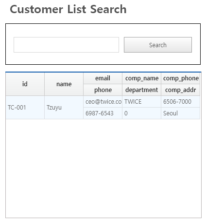

# 소규모 조직의 직원 및 부서 관리를 위한 인사 관리 실습

## 1. Static 컴포넌트 사용
- **텍스트 속성 수정**
  - `F2` 버튼으로 텍스트 속성 수정
  - 속성창에서 `ID`로 검색 후 수정 가능
- **이벤트 추가**
  - 더블클릭으로 이벤트 열기
  - 클릭 후 **Properties** 창에서 이벤트 선택
  - 실행 가능 환경:
    - **Web Runtime Environment**
    - **Nexacro Runtime Environment**

---

## 2. 테스트 환경 구성
1. **톰캣 Apache 다운로드**
   - [톰캣 다운로드](https://tomcat.apache.org/)
2. **톰캣 실행 확인**
   - 브라우저에서 `http://localhost:8080` 입력
3. **Generate Path 지정**

---

## 3. 실습하기
- Nexacro 공식 문서: [링크](https://docs.tobesoft.com/nexacro_17_ko)

---

## 4. 데이터셋 생성 및 조작
### **폼 작성**
- **Database Editor** 사용
- 레코드 생성:
  - `Ctrl + 1` → 헤더 생성
  - `Ctrl + 2` → 바디 생성
- 컬럼 생성: `Ctrl + 8`
- 데이터 병합: `Ctrl + M`
- 데이터 바인딩 추가

### **클릭 핸들러**
- `onclick` 핸들러를 사용하여 고객 리스트 반환  
  

---

## 5. 트랜잭션 이해하기
- 서버와 클라이언트 간 데이터 송수신 처리 방법 학습
- **데이터 송수신 흐름**:
  1. Nexacro → API 호출
  2. 서버에서 데이터 처리
  3. Nexacro에서 데이터 출력
